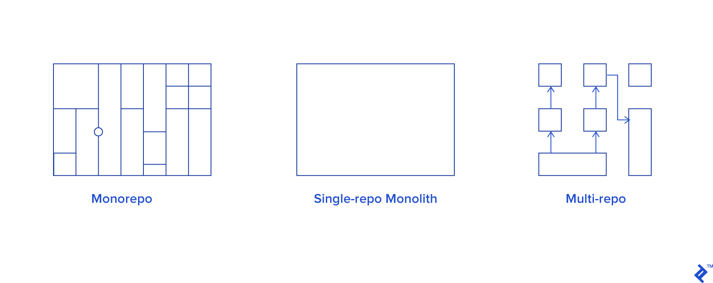

# Monorepo

A Monorepo is a repository where you keep all the isolated parts of your code in one repository. The opposite of a monorepo is a repository for each part of your code.

### Why

Modern Front-end software development is dependent on many components that are single-serving separated by areas of concern \(test suites, css, build scripts, utilities, etc\). When dependencies are updated, having dependencies in their own repos mean that they have to be updated N number of times, introducing overhead and complexity to maintain all the dependencies.

### Advantages

* One place to store tests, build scripts
* Reduce dependency installation duplication
* Easier to search dependencies

### Disadvantages

* Poor git performance on large projects

#### Sources

* [https://www.toptal.com/front-end/guide-to-monorepos](https://www.toptal.com/front-end/guide-to-monorepos)

